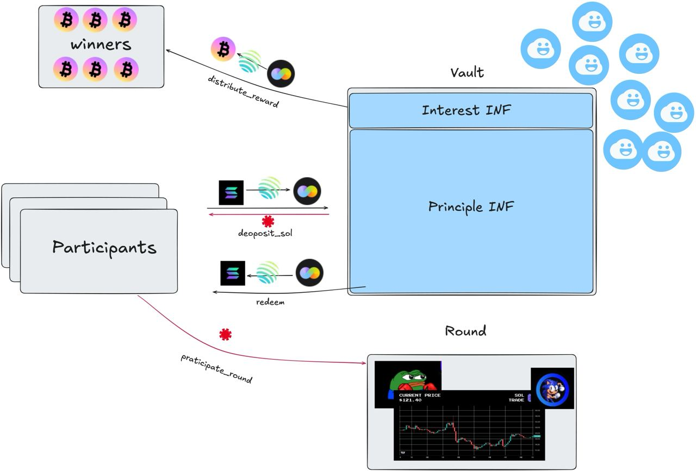

# 🏆 Trade.fun 🏆 - The ultimate degen perp trading game

Trade.fun is the ultimate on-chain trading competition platform where users can stake their yield from Solana LSTs and earn ZBTC rewards without risking their principal.
We've built a transparent, verifiable system where trading performance is recorded on-chain, eliminating trust issues common in traditional trading competitions. (check the demo [here](https://youtu.be/Zu-sHhpZ2Ek))

What sets us apart is our vision for the future: influencers creating trading DAOs where followers can copy successful strategies, exciting DAO vs DAO battles that create community-driven competition, and even the ability to test your skills against AI trading agents. With our streamlined UX powered by Banana Pay, we've made sophisticated trading accessible to everyone.

Trade.fun isn't just about making profits—it's about building reputation, showcasing skills, and participating in a revolutionary trading ecosystem that brings the excitement of competition to DeFi.

## Platform Overview

Trade.fun offers a secure trading environment where participants:

1. Deposit SOL to join trading rounds
2. Compete using INF tokens (principal stays secure)
3. Win ZBTC rewards based on trading performance
4. Redeem the principle on round end

## Core Technical Architecture

- Built native Solana program using Rust and Anchor framework
- Implemented on-chain state management with secure account structures
- Utilized SPL tokens for handling zBTC and SOL interactions

## Smart Contract Implementation

- Developed instructions for SOL deposits and reward distribution
- Created PDAs for secure vault management
- Used Solana's atomic transaction model for safe SOL-to-INF conversions

## Vault Mechanism

The platform employs a mathematically rigorous vault system with two fundamental components:

- **Principal INF (P₀)**: Users' initial deposits, secured and protected throughout
- **Interest INF (I₁)**: Yield generated from deposits, calculated as I₁ = P₁ - P₀

When users deposit SOL:

1. SOL is converted to INF tokens via Jupiter DEX: SOL → INF
2. The initial exchange rate (R₀) is recorded in PDAs where R₀ = INF/SOL at t=0
3. Principal amount P₀ = INF_initial is locked in the vault
4. Only generated interest (I₁) is distributed to winners

### Exchange Rate Tracking & Yield Calculation

- PDAs store initial exchange rate R₀ at deposit time t=0
- Smart contract calculates real-time rate changes (Rₜ) using Pyth oracle data
- At time t, if current exchange rate is Rₜ, then:
  - Principal value: P₀ = (R₀/Rₜ) × Total_INF
  - Interest available: I₁ = Total_INF - P₀
  - Mathematically: I₁ = Total_INF × (1 - R₀/Rₜ)

Example:

- If INF/SOL rate increases by 10% (Rₜ = 1.1 × R₀), then:
  - P₀ = Total_INF × (R₀/Rₜ) = Total_INF × (R₀/(1.1×R₀)) = Total_INF × (1/1.1) ≈ 0.909 × Total_INF
  - Therefore, principal becomes ~90.9% of total INF
  - Interest available for distribution: I₁ = Total_INF - P₀ ≈ 0.091 × Total_INF (9.1% of total)

## Platform Flow (as shown in diagram)



1. **Participants** deposit SOL through the platform
2. SOL is converted to INF tokens and stored in the **Vault**
3. Participants join **Rounds** using CHIP tokens
4. Winners receive rewards from the interest generated in the form of zBTC
5. Users can redeem their principal at any round end

## Technical Integrations

### Jupiter Integration

- Used Jupiter's aggregator for optimal token swaps
- Integrated CPI for SOL-to-INF conversions

### Pyth Oracle Integration

- Used for real-time INF/SOL and USD price data
- Implemented safety mechanisms to verify price feed accuracy

### Token Management

- Secure token transfers via SPL token program
- Token vaults controlled by program PDAs
- Trustless minting/burning operations for CHIP tokens

## Current Features

Our yield-based trading model lets users earn ZBTC rewards via LST in Sanctum without risking their principal investment. The platform provides:

- Real-time trading competitions
- Secure vault management
- Transparent reward distribution

## Future Roadmap

We're expanding the platform with exciting new features:

1. **DAO vs DAO Competitions**: Creating new social dynamics in trading
2. **Copy Trading**: Connecting influencers with followers
3. **AI vs Human Battles**: Pushing strategic boundaries in trading
4. **Streamlined UX via Banana Pay**: Making sophisticated trading accessible to everyone

All while maintaining full on-chain transparency and security.

## CLI Usage Guide

The Trade.fun platform provides a set of CLI scripts to interact with the deployed smart contract. These scripts allow you to manage the entire lifecycle of trading rounds and user interactions.

### Prerequisites

1. Create a `.env` file with your configuration:

```
RPC_URL=https://api.mainnet-beta.solana.com
KEYPAIR=your_base58_encoded_private_key
```

2. Install dependencies:

```bash
npm install
```

### Available Commands

Each script is designed to interact with a specific contract functionality:

#### 1. Deposit SOL

Deposits SOL into the platform, converting it to INF tokens and storing them in the vault.

```bash
npx ts-node cli/deposit.ts <amount_in_sol> <round_number>
```

#### 2. Initialize a New Trading Round

Creates a new trading round with specified parameters.

```bash
npx ts-node cli/initializeRound.ts <round_number> <start_timestamp> <end_timestamp>
```

#### 3. Start a Trading Round

Activates a previously initialized round.

```bash
npx ts-node cli/startRound.ts <round_number>
```

#### 4. Participate in a Round

Allows a user to join an active trading round.

```bash
npx ts-node cli/participateRound.ts <round_number>
```

#### 5. Close a Trading Round

Finalizes a round after its end time has passed.

```bash
npx ts-node cli/closeRound.ts <round_number>
```

#### 6. Distribute Rewards

Distributes earned interest to round winners.

```bash
npx ts-node cli/distributeReward.ts <round_number>
```

#### 7. Distribute ZBTC Rewards

Distributes ZBTC rewards to round winners.

```bash
npx ts-node cli/distributeZbtcReward.ts <round_number>
```

#### 8. Redeem Principal

Allows users to withdraw their principal from the vault.

```bash
npx ts-node cli/redeem.ts
```

### Monitoring Tools

The platform also includes tools to check the status of rounds and reward balances:

```bash
# Check status of all rounds
npx ts-node cli/check_rounds.ts

# Check reward balance
npx ts-node cli/check_reward_balance.ts
```

### Example Workflow

A typical workflow for managing a trading round:

1. Initialize a new round
2. Users deposit SOL to join
3. Start the round at the scheduled time
4. Users participate in trading
5. Close the round after end time
6. Distribute rewards to winners
7. Users can redeem their principal

## Deployment Information

### Program Deployment

- Deployed on Solana Mainnet

- **Program ID**: `B1ph2kyNtkhscRQ3R1CAwMNM4PbGGvphHTzxR83kRsRc`
- **CHIP Token ID**: `chip6YRCCXMy1uLbGRNErT66aYGdaVsVCQ25VA1LWNN`
